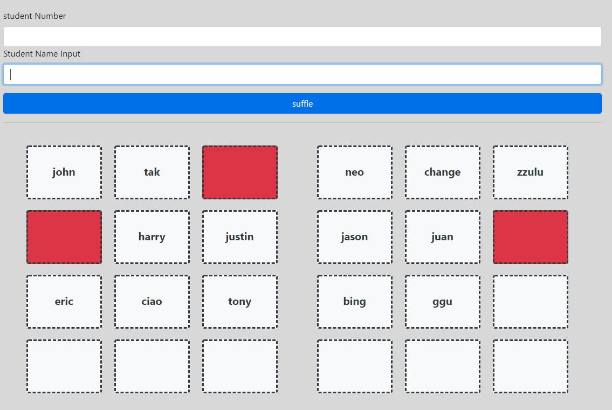
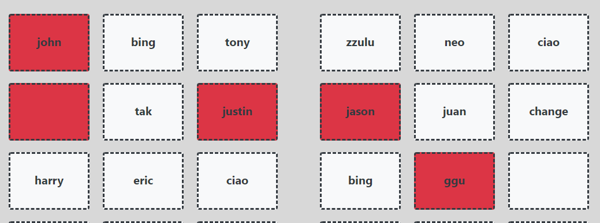

## 사용 방법

1. 학생 수 입력 ( 반드시 엔터키 입력해야 합니다. )
2. 이름 입력 ( enter ) * 학생수 
   - 현재 이름 제거 기능이 없습니다... 새로고침 해 주시면 됩니다.
3. suffle

## 자리 비우기

- 비워두고 싶은 자리를 클릭해 두고 이름을 입력하면 해당 자리는 비워 둘 수 있습니다.

## 자리 고정 // 고정 해제

- 이름을 입력 한 상태로 클릭하여 고정 상태로 둔다. → 셔플 버튼을 눌러도 자리가 바뀌지 않는다.
- 고정 해제를 풀고 싶다면 해당 div를 다시 클릭 한다.

## 추가 예정 기능

1. 삽입 및 제거 기능 추가 
   - 빈 값 입력 불가
   - 이름 전체 삭제
   - 자리별 이름 제거
   - 자리별 이름 삽입
   - 프로그래밍 언어 유경험자 ( 혹은 특정 학생군 ) 중앙 자리 배치
2. 3x3 이외 자리 배치도 설정 
   - ex) 2x2x2 혹은  직접 입력
3. CSS 보완